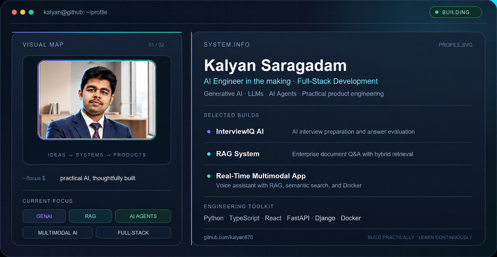

  <picture>
    <source media="(prefers-color-scheme: dark)" srcset="./profile-dark.png">
    <source media="(prefers-color-scheme: light)" srcset="./profile-light.png">
    
  </picture>

<strong>AI Engineer in the making · GenAI · LLMs · AI Agents · Full-Stack Development</strong>

I build practical AI-powered products that turn ambitious ideas into useful, accessible experiences. My work sits at the intersection of **Generative AI, intelligent automation, retrieval systems, computer vision, and modern web development**.

  <a href="#about-me">About</a> ·
  <a href="#what-i-build">Focus Areas</a> ·
  <a href="#featured-projects">Featured Work</a> ·
  <a href="#more-projects">More Projects</a> ·
  <a href="#tech-stack">Tech Stack</a> ·
  <a href="#github-activity">Activity</a> ·
  <a href="#content-community">Community</a> ·
  <a href="#lets-connect">Connect</a>

---

## About me

- 🔭 Building AI products across **RAG, agents, multimodal systems, and intelligent automation**
- 🧠 Exploring how LLMs can make software more useful, explainable, and human-centered
- 🛠️ Combining AI engineering with full-stack development to take ideas from prototype to product
- 📚 Documenting my learning through projects, posts, courses, and certificates at [KalyanHub](https://github.com/kalyan870/kalyanhub)
- 🤝 Interested in collaborating on practical AI tools, developer products, and socially useful applications

## What I build

| Area | Focus |
| --- | --- |
| **Generative AI** | LLM applications, prompt engineering, local models, and AI-assisted workflows |
| **RAG & Knowledge Systems** | Document search, hybrid retrieval, reranking, evaluation, and codebase intelligence |
| **AI Agents** | Tool use, workflow automation, task execution, and decision support |
| **Multimodal AI** | Voice assistants, image recognition, captioning, and computer vision |
| **Full-Stack Applications** | Responsive interfaces, authentication, real-time features, APIs, and dashboards |
| **Applied AI** | Career tools, customer feedback intelligence, observability, forecasting, and risk awareness |

## Featured projects

<table>
  <tr>
    <td width="50%" valign="top">
      <h3><a href="https://github.com/kalyan870/interviewiq-ai">InterviewIQ AI</a></h3>
      
An AI-powered full-stack interview preparation platform with personalized interviews, answer evaluation, voice interviews, resume intelligence, project defense, analytics, authentication, and cross-device synchronization.

    </td>
    <td width="50%" valign="top">
      <h3><a href="https://github.com/kalyan870/rag-system">RAG System</a></h3>
      
A production-oriented enterprise document question-answering system featuring hybrid search, reranking, and evaluation.

    </td>
  </tr>
  <tr>
    <td width="50%" valign="top">
      <h3><a href="https://github.com/kalyan870/realtime-multimodal-app">Real-Time Multimodal App</a></h3>
      
A real-time voice assistant built around RAG, OpenRouter LLMs, semantic search, and Docker-based deployment.

    </td>
    <td width="50%" valign="top">
      <h3><a href="https://github.com/kalyan870/local-slm-ollama-lab">Local SLM Ollama Lab</a></h3>
      
A local AI benchmarking dashboard for comparing small language models such as Qwen, Mistral, Llama, Phi, and Gemma across performance and deployment metrics.

    </td>
  </tr>
  <tr>
    <td width="50%" valign="top">
      <h3><a href="https://github.com/kalyan870/django-fetch-guard">Django Fetch Guard</a></h3>
      
A Django performance tool designed to prevent accidental ORM queries, enforce strict fetch contracts, support automatic N+1 batching, and integrate with Django REST Framework.

    </td>
    <td width="50%" valign="top">
      <h3><a href="https://github.com/kalyan870/face-emotion">Face Emotion</a></h3>
      
A real-time facial emotion recognition and analytics dashboard combining MediaPipe, computer vision, TypeScript, and Python.

    </td>
  </tr>
</table>

## More projects

| Project | Overview |
| --- | --- |
| [KalyanHub](https://github.com/kalyan870/kalyanhub) | learning and portfolio hub for AI engineering projects, posts, courses, and certificates |
| [GrowthCortex](https://github.com/kalyan870/growthcortex) | AI startup growth copilot for ideas, strategy, experiments, and product decisions |
| [Customer Feedback Analyzer](https://github.com/kalyan870/Customer-Feedback-Analyzer) | NLP, sentiment analysis, Generative AI, and RAG for customer feedback intelligence |
| [AI Automation Agent](https://github.com/kalyan870/AI-Automation-Agent) | an agent for coordinating tools and automating repetitive workflows |
| [Codebase Knowledge AI](https://github.com/kalyan870/codebase-knowledge-ai) | AI-powered assistance for exploring software projects and answering codebase questions |
| [Smart Inventory Forecasting](https://github.com/kalyan870/Smart-Inventory-Forecasting) | demand trends, stock planning, and supply-chain insights |
| [AI Resume & Job Matcher](https://github.com/kalyan870/AI-Resume-Job-Matcher-System) | profile parsing, fit scoring, gap identification, and role recommendations |
| [Image Recognition API](https://github.com/kalyan870/Image-Recognition-API-with-Auto-Captioning) | image recognition and automatic caption generation through an interactive API |

## Tech Stack

<em>Tools and technologies I use to build AI and full-stack applications</em>

  

<table align="center">
  <tr>
    <td align="center" width="190"><strong>🧠 Languages & Core</strong></td>
    <td align="center">
      
      
    </td>
  </tr>
  <tr>
    <td align="center"><strong>🤖 AI · ML · Vision</strong></td>
    <td align="center">
      
      
      
      
      
    </td>
  </tr>
  <tr>
    <td align="center"><strong>🧩 Apps & APIs</strong></td>
    <td align="center">
      
      
      
    </td>
  </tr>
  <tr>
    <td align="center"><strong>☁️ Cloud · Delivery</strong></td>
    <td align="center">
      
    </td>
  </tr>
  <tr>
    <td align="center"><strong>🗄️ Data · Retrieval</strong></td>
    <td align="center">
      
      
    </td>
  </tr>
</table>

<strong>🧬 GenAI · LLMs · Agents · Retrieval</strong>

  
  
  
  
  

## Open Source Contributions

<table>
  <tr>
    <td width="50%" valign="top">
      <h3>🌐 Community Contributions</h3>
      
Browse my public pull requests and contributions to open-source projects.

      <a href="https://github.com/pulls?q=is%3Apr+author%3Akalyan870+-user%3Akalyan870">Explore open-source pull requests →</a>
    </td>
    <td width="50%" valign="top">
      <h3>✅ Merged Contribution</h3>
      
Added a hidden fetch examples gallery to <code>django-fetch-guard</code>.

      <a href="https://github.com/yassinbahri/django-fetch-guard/pull/13">View merged pull request #13 →</a>
    </td>
  </tr>
</table>

## GitHub activity

  
  

  

  

<h3 align="center">🐍 Watch My Contributions Get Eaten</h3>

  <picture>
    <source media="(prefers-color-scheme: dark)" srcset="https://raw.githubusercontent.com/kalyan870/kalyan870/output/github-contribution-grid-snake-dark.svg">
    <source media="(prefers-color-scheme: light)" srcset="https://raw.githubusercontent.com/kalyan870/kalyan870/output/github-contribution-grid-snake.svg">
    
  </picture>

## Content & Community

<table>
  <tr>
    <td width="33%" valign="top">
      <h3>📚 Learning & Portfolio</h3>
      
Documenting my learning through projects, posts, courses, and certificates.

      <a href="https://github.com/kalyan870/kalyanhub">Explore KalyanHub →</a>
    </td>
    <td width="33%" valign="top">
      <h3>✍️ Writing</h3>
      
Sharing ideas and learning notes through my writing.

      <a href="https://saragadamkalyan.substack.com">Read on Substack →</a>
    </td>
    <td width="33%" valign="top">
      <h3>🤝 Connect & Collaborate</h3>
      
Interested in collaborating on practical AI tools, developer products, and socially useful applications.

      <a href="https://www.linkedin.com/in/saragadamkalyan">Connect on LinkedIn →</a>
    </td>
  </tr>
</table>

## Let's connect

- 💼 [LinkedIn](https://www.linkedin.com/in/saragadamkalyan)
- ✍️ [Substack](https://saragadamkalyan.substack.com)
- 🧑‍💻 [Explore my repositories](https://github.com/kalyan870?tab=repositories)

> Build practically. Learn continuously. Share what works.

⭐ If you find something useful here, feel free to star a repository or start a conversation.
